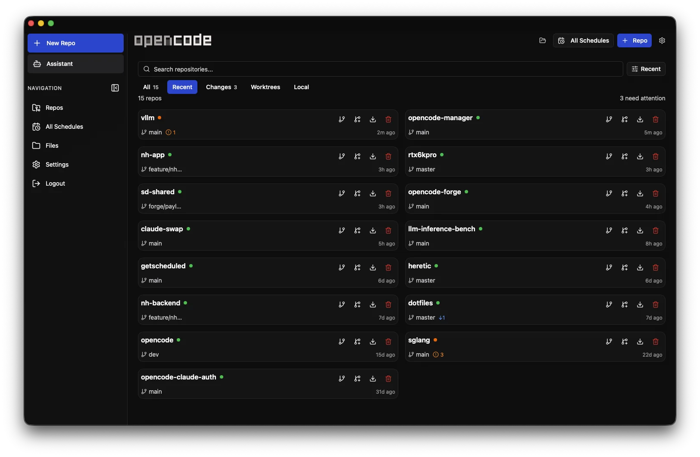

<p align="center">
    
</p>

<p align="center">
    <strong>Mobile-first web interface for <a href="https://opencode.ai">OpenCode</a> AI agents. Manage, control, and code from any device.</strong>
</p>

<p align="center">
    <a href="https://github.com/chriswritescode-dev/opencode-manager/blob/main/LICENSE">
        
    </a>
    <a href="https://github.com/chriswritescode-dev/opencode-manager/stargazers">
        
    </a>
    <a href="https://github.com/chriswritescode-dev/opencode-manager/releases/latest">
        
    </a>
    <a href="https://github.com/chriswritescode-dev/opencode-manager/pulls">
        
    </a>
</p>

<p align="center">
  
</p>

## Quick Start

```bash
git clone https://github.com/chriswritescode-dev/opencode-manager.git
cd opencode-manager
cp .env.example .env
echo "AUTH_SECRET=$(openssl rand -base64 32)" >> .env
docker-compose up -d
# Open http://localhost:5003
```

On first launch, you'll be prompted to create an admin account. That's it!

For local development setup, see the [Development Guide](https://chriswritescode-dev.github.io/opencode-manager/development/setup/).


## Features

- **Repositories & Git** — Multi-repo management, local discovery, SSH auth, worktrees, unified diffs, branch and commit management
- **Chat & Sessions** — Real-time SSE streaming, slash commands, `@file` mentions, Plan/Build modes, Mermaid diagram rendering
- **Files** — Directory browser with tree view, syntax highlighting, create/rename/delete, ZIP download
- **Assistant Mode** — Dedicated AI workspace with auto-provisioned skills for schedules, notifications, settings, and repo operations
- **Schedules** — Recurring repo jobs with reusable prompts, run history, linked sessions, markdown-rendered output
- **MCP Servers** — Add, configure, authenticate, and manage local or remote MCP servers with OAuth support
- **AI Configuration** — Model/provider setup, API keys, OAuth for Anthropic and GitHub Copilot, custom agent definitions
- **Skills** — Extend agent capabilities with shareable, scoped skill definitions
- **Notifications** — Push notifications for session events, questions, errors, and completions
- **Audio** — Text-to-speech and speech-to-text (browser native and OpenAI-compatible APIs)
- **Mobile & PWA** — Responsive mobile-first UI, installable on any device, iOS-optimized

## Architecture

OpenCode Manager is a pnpm workspace with three TypeScript packages:

- `backend/` — Bun + Hono API server with Better Auth, SQLite migrations, OpenCode process management, SSE, schedules, and push notifications.
- `frontend/` — React + Vite SPA using React Router, TanStack Query, Radix UI/Tailwind, service worker support, and mobile-first navigation.
- `shared/` — shared Zod schemas, config helpers, types, and utilities consumed by both backend and frontend.

A MkDocs Material site (`docs/`) provides guides, feature docs, configuration, and troubleshooting.

## Development

This repo uses pnpm workspaces for `shared`, `backend`, and `frontend`.

```bash
pnpm install
pnpm dev
pnpm lint
pnpm typecheck
pnpm test
```

See the [Development Guide](https://chriswritescode-dev.github.io/opencode-manager/development/setup/) for local setup, scripts, database notes, and testing.

## Configuration

```bash
# Required for production
AUTH_SECRET=your-secure-random-secret  # Generate with: openssl rand -base64 32

# Pre-configured admin (optional)
ADMIN_EMAIL=admin@example.com
ADMIN_PASSWORD=your-secure-password

# For LAN/remote access
AUTH_TRUSTED_ORIGINS=http://localhost:5003,https://yourl33tdomain.com
AUTH_SECURE_COOKIES=false  # Set to true when using HTTPS
```

For OAuth, Passkeys, Push Notifications (VAPID), and advanced configuration, see the [Configuration Guide](https://chriswritescode-dev.github.io/opencode-manager/configuration/environment/).

## `ocm` CLI

OpenCode Manager ships an `ocm` CLI (from `ocm-cli/`) that attaches your local OpenCode TUI to a repo hosted on the Manager. It lists ready repos, attaches via the Manager's `/api/opencode-proxy` (so prompts run on the Manager's filesystem against a single shared OpenCode server), and can tarball-sync the working tree up or down with `ocm push` / `ocm pull`. Running `ocm` inside a local clone auto-detects the matching Manager repo by `origin` URL.

See the [`ocm` CLI guide](docs/ocm-cli.md) for setup and commands.

## Documentation

- [Getting Started](https://chriswritescode-dev.github.io/opencode-manager/getting-started/installation/) — Installation and first-run setup
- [Features](https://chriswritescode-dev.github.io/opencode-manager/features/overview/) — Deep dive on all features
- [Configuration](https://chriswritescode-dev.github.io/opencode-manager/configuration/environment/) — Environment variables and advanced setup
- [Troubleshooting](https://chriswritescode-dev.github.io/opencode-manager/troubleshooting/) — Common issues and solutions
- [Development](https://chriswritescode-dev.github.io/opencode-manager/development/setup/) — Contributing and local development
- [`ocm` CLI](docs/ocm-cli.md) — Attach local OpenCode TUI to Manager repos

## License

MIT
